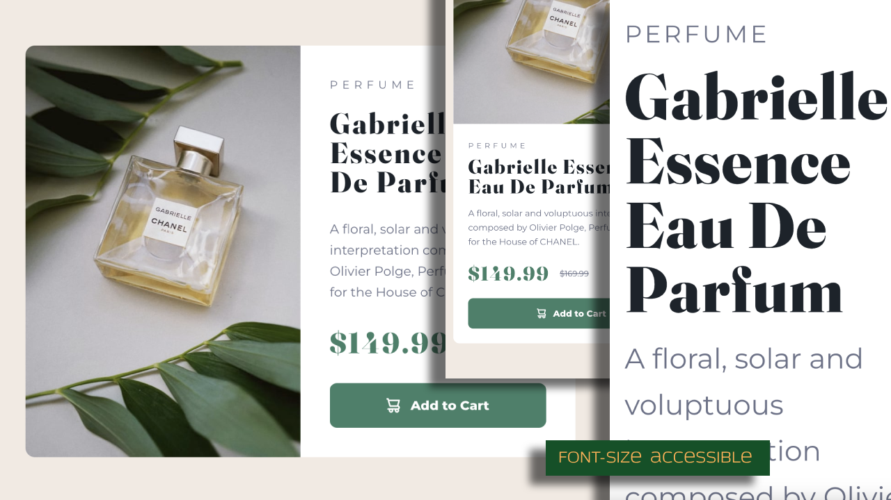

# Frontend Mentor - Product preview card component solution

This is a solution to the [Product preview card component challenge on Frontend Mentor](https://www.frontendmentor.io/challenges/product-preview-card-component-GO7UmttRfa). Frontend Mentor challenges help you improve your coding skills by building realistic projects.

## Table of contents

- [Overview](#overview)
  - [The challenge](#the-challenge)
  - [Screenshot](#screenshot)
  - [Links](#links)
- [My process](#my-process)
  - [Built with](#built-with)
  - [What I learned](#what-i-learned)
  - [Useful resources](#useful-resources)
- [Author](#author)

## Overview

In this challenge, I will be continuing my focus on semantically correct HTML, accessibility, responsive Less CSS, and BEM. In the design files, while I'm measuring, I'll run by small inconsistencies in spacing between elements, So I'll also be focusing on using consistent layout settings.

### The challenge

Users should be able to:

- View the optimal layout depending on their device's screen size
- See hover and focus states for interactive elements

### Screenshot

### Links

- Solution URL: [Add solution URL here](https://your-solution-url.com)
- Live Site URL: [Product Preview Card Component](https://productpreviewcardfem.netlify.app)

## My process

- Copied over starter files from project folder
- Initialized Git and GitHub
- Analyzed Figma design file
- Initialized Git and Github
- Added semantic HTML tags
- Set up Less
- Set up CSS Reset
- Set up typography config
- Set up colors config
- Add base styling mobile
- Add base styling desktop
- a11y check: zoom (scale content if user sets font-size to 200%, 300%, etc)
- a11y check: interactive elements (tooltips with mouse & keyboard)
- a11y check: Semantic HTML and screen readers (not yet done)
- Refactor for dev readibility
- Deploy

### Built with

- Semantic HTML5 markup
- Less
- BEM
- Flexbox
- Grid
- Mobile-first workflow

### What I learned

- I learned how to use Less
- I learned how to add a tooltip on an element when it's focus from the keyboard

### Useful resources

- [Less Documentation](https://lesscss.org/)
- [CSS Reset](https://www.joshwcomeau.com/css/custom-css-reset/)

## Author

- Website - [Steve Xero](https://www.stevexero.com) - under construction
- Old [Website](https://www.steven-woodward.com)
- GitHub - [Steve Xero](https://www.github.com/stevexero)
- Frontend Mentor - [@stevexero](https://www.frontendmentor.io/profile/stevexero)
- X - [@steve_xero](https://www.twitter.com/steve_xero)
